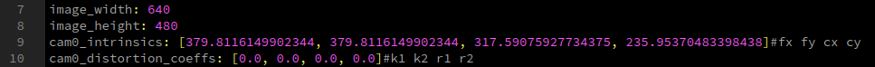

#  FLVIS
## Feedback Loop Based Visual Inertial SLAM

### 1-Video
<a href="https://www.youtube.com/embed/ljZWb2x6CRQ" target="_blank"></a>

| EuRoC DataSet MH_05    | Handheld Test in Lab   | FlVIS on UAV Platform  |
| ---------------------- | ---------------------- |---------------------- |
|   |   |   |

### 2-Relevent Publication:
Under Review, a pre-print version can be found [here](https://arxiv.org/abs/2007.02250)
### 3-Support Hardware/Dataset:
Intel RealSense D435i Camera <br />
EuRoC MAV Dataset
### 4-Build The Project
We have tested in the following environment: <br />
Ubuntu 16.04 + ROS Kinetic <br />
Ubuntu 18.04 + ROS melodic <br />
Clone the repository to the catkin work space eg. /catkin_ws/src
````
git clone https://github.com/Ttoto/FLVIS.git
````
Install 3rd Part library
````
sudo apt-get install libsuitesparse-dev 
sudo apt-get install ros-melodic-octomap

````
````
cd catkin_ws/src/FLVIS/3rdPartLib/
./install3rdPartLib.sh
````
Compile
````
cd ~/catkin_ws
catkin_make
````
### 5-Verification
#### 5.1 D435i Camera
##### 5.1.1 Use our recorded rosbag 
Download the dataset [Link-melab_sn943222072828.bag](https://drive.google.com/file/d/1kfOkQTt-i-Hd2M0FZa8Dia4_BweE-ttf/view?usp=sharing) to /bag folder <br />
Decompress the rosbag:
````
rosbag decompress melab_sn943222072828.bag
````
run the following launch files:
````
roslaunch flvis rviz.launch
roslaunch flvis flvis_bag.launch
````
##### 5.1.2 Use your own camera:
Install the [realsense driver](https://github.com/IntelRealSense/librealsense) and its [ros wrapper](https://github.com/IntelRealSense/realsense-ros) <br />
Boot the d435i camera and echo the camera infomation
````
roslaunch flvis d435i.launch
rostopic echo /camera/infra1/camera_info
````
You will get the camera infomation like:

As shown, where the fx=384.16455078125; fy=384.16455078125; cx=320.2144470214844;cy=238.94403076171875. <br />
Edit these information in the config yaml file (say: /launch/d435i/d435i_sn943222072828.yaml):

In the launch file "flvis_d435i.launch", make sure "/yamlconfigfile" is point to the edited config file
````
<param name="/yamlconfigfile" type="string" value="$(find flvis)/launch/d435i/d435i_sn943222072828.yaml"/>
````
run the following launch files:
````
roslaunch flvis rviz.launch
roslaunch flvis flvis_d435i.launch
````

#### 5.2 EuRoC MAV Dataset
Download the dataset(say MH_05_difficult) into the bag folder:
````
roscd flvis/bag/
wget http://robotics.ethz.ch/~asl-datasets/ijrr_euroc_mav_dataset/machine_hall/MH_05_difficult/MH_05_difficult.bag
````
Edit the corresponding bag name in flvis_euroc_mav.launch file:
````
<node pkg="rosbag" type="play" name="rosbag" args="$(find flvis)/bag/MH_05_difficult.bag"/>
````
run the following launch files:
````
roslaunch flvis rviz.launch
roslaunch flvis flvis_euroc_mav.launch
````


### Maintainer:
[Shengyang Chen](https://www.polyu.edu.hk/researchgrp/cywen/index.php/en/people/researchstudent.html)(Dept.ME,PolyU): shengyang.chen@connect.polyu.hk <br />
Yajing Zou(Dept.LSGI,PolyU):rick.zou@connect.polyu.hk
