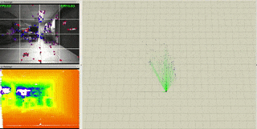
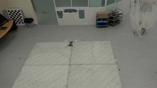
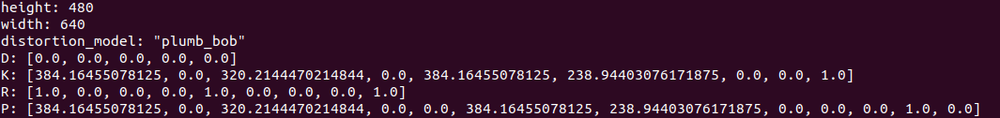

#  FLVIS
The implementation of Feedforward-feedback Loop-based Visual Inertial System. If you want to use FLVIS with GPU acceleration, try this [repo](https://github.com/JazzyFeng/FLVIS-gpu).

### 1-Video
<a href="https://www.youtube.com/embed/U1GmOICc1Ac" target="_blank"></a>

| EuRoC DataSet MH_05    | Handheld Test in Lab   | FlVIS on UAV Platform  |
| ---------------------- | ---------------------- |---------------------- |
|   |   |   |

### 2-Relevent Publication:
[Stereo Visual Inertial Pose Estimation Based on Feedforward and Feedbacks](https://ieeexplore.ieee.org/document/10155195)
### 3-Support Hardware/Dataset:
Intel RealSense D435i Camera <br />
EuRoC MAV Dataset
### 4-Build The Project
We have tested in the following environment: <br />
Ubuntu 16.04 + ROS Kinetic <br />
Ubuntu 18.04 + ROS melodic <br />
Ubuntu 20.04 + ROS noetic <br />
Clone the repository to the catkin work space eg. `/catkin_ws/src`
````
git clone https://github.com/HKPolyU-UAV/FLVIS.git
````
Install 3rd Part library
````
cd catkin_ws/src/FLVIS/3rdPartLib/
./install3rdPartLib.sh
````
Compile
````
cd ~/catkin_ws
catkin_make
````
### 5-Verification
Support Platform D435i(Depth/Stereo Mode), EuRoC Dataset, KITTI Dataset
#### 5.1 D435i Camera Depth Mode
##### 5.1.1 Use our recorded rosbag 
Download the dataset [Link-melab_sn943222072828.bag](https://drive.google.com/file/d/1kfOkQTt-i-Hd2M0FZa8Dia4_BweE-ttf/view?usp=sharing) to `/bag` folder <br />
Decompress the rosbag:
````
rosbag decompress melab_sn943222072828.bag
````
run the following launch files:
````
roslaunch flvis rviz_bag.launch
roslaunch flvis flvis_bag.launch
````
##### 5.1.2 Use your own camera:
Install the [realsense driver](https://github.com/IntelRealSense/librealsense) and its [ros wrapper](https://github.com/IntelRealSense/realsense-ros) <br />
Boot the d435i camera and echo the camera infomation
````
roslaunch flvis d435i_depth.launch
rostopic echo /camera/infra1/camera_info
````
You will get the camera infomation like:

As shown, where the resolution is 640x480 and `fx=384.16455078125; fy=384.16455078125; cx=320.2144470214844;cy=238.94403076171875.` <br />
Edit these information in the config yaml file (say: `/launch/d435i/sn943222072828_depth.yaml`):
```yaml
image_width: 640
image_height: 480
cam0_intrinsics: [384.16455078125, 384.16455078125, 320.2144470214844, 238.94403076171875]#fx fy cx cy
cam0_distortion_coeffs: [0.0, 0.0, 0.0, 0.0]#k1 k2 r1 r2
```
In the launch file `flvis_d435i.launch`, make sure `/yamlconfigfile` is point to the edited config file
````
<param name="/yamlconfigfile" type="string" value="$(find flvis)/launch/d435i/sn943222072828_depth.yaml"/>
````
run the following launch files:
````
roslaunch flvis rviz_bag.launch
roslaunch flvis flvis_d435i_depth.launch
````
#### 5.2 D435i Camera Stero Mode
Like what we did in 5.1.2, we need to config the `sn943222072828_stereo.yaml` <br />
Note that, by default the two camera share the same intrinsic parameters, and the baseline length is 0.05m:
```yaml
cam0_intrinsics: [384.16455078125, 384.16455078125, 320.2144470214844, 238.94403076171875]#fx fy cx cy
cam0_distortion_coeffs: [0.0, 0.0, 0.0, 0.0]#k1 k2 r1 r2
cam1_intrinsics: [384.16455078125, 384.16455078125, 320.2144470214844, 238.94403076171875]#fx fy cx cy
cam1_distortion_coeffs: [0.0, 0.0, 0.0, 0.0]#k1 k2 r1 r2
T_cam0_cam1:
[ 1.0,  0.0,  0.0,  0.05,
  0.0,  1.0,  0.0,  0.0,
  0.0,  0.0,  1.0,  0.0,
  0.0,  0.0,  0.0,  1.0]

```
#### 5.3 D435i Camera Depth/Stereo + Pixhawk IMU Mode
We also support fusing any Inertial Measurement Unit (IMU), and stereo camera or depth camera. For example, a very common application is running VIO on quadrotors to estimate its own pose by IMU readings from [Pixhawk](https://docs.px4.io/master/en/flight_controller/pixhawk4.html). We need to config the `catkin_ws/FLVIS/launch/d435_pixhawk/sn841512070537_depth_px4.yaml` or `catkin_ws/FLVIS/launch/d435_pixhawk/sn943222072828_stereo_px4.yaml` <br />
run the following launch files:
````
roslaunch flvis flvis_d435_pixhawk_depth.launch
````
or
````
roslaunch flvis flvis_d435_pixhawk_stereo.launch
````
Check your [mavros](http://wiki.ros.org/mavros) status by:
````
rostopic echo /mavros/imu/data
````
If IMU response normally, then open a new terminal, and check by:
````
rostopic echo /mavros/local_position/pose
````

#### 5.4 EuRoC MAV Dataset
Download the dataset(say MH_05_difficult) into the bag folder:
````
roscd flvis/bag/
wget http://robotics.ethz.ch/~asl-datasets/ijrr_euroc_mav_dataset/machine_hall/MH_05_difficult/MH_05_difficult.bag
````
Edit the corresponding bag name in `flvis_euroc_mav.launch` file:
````
<node pkg="rosbag" type="play" name="rosbag" args="$(find flvis)/bag/MH_05_difficult.bag"/>
````
run the following launch files:
````
roslaunch flvis rviz_euroc.launch
roslaunch flvis flvis_euroc_mav.launch
````

#### 5.5 KITTI Dataset
Download the dataset into the bag folder:

 

Decompress `poses.zip` file and edit the corresponding bag name in `flvis_kitti.launch` file:
````
<param name="/publish_gt"             type="bool"    value="true" />
<param name="/dataset_folder_path"    type="string"  value="$(find flvis)/bag/KITTI/dataset/sequences/00/" />
<param name="/dataset_gt_file"        type="string"  value="$(find flvis)/bag/KITTI/dataset/poses/00.txt" />
````
run the following launch files:
````
roslaunch flvis rviz_kitti.launch
roslaunch flvis flvis_kitti.launch
````
If tracking failure or optimize failure happen, please try a lower dataset publish rate 10 or 15 instead:
````
<param name="/dataset_pub_rate"       type="int"     value="15" />
````

### Maintainer:
[Shengyang Chen](https://www.polyu.edu.hk/researchgrp/cywen/index.php/en/people/alumni.html)(Dept.ME,PolyU): shengyang.chen@connect.polyu.hk <br />
[Yurong Feng](https://www.polyu.edu.hk/researchgrp/cywen/index.php/en/people/current-members.html)(Dept.AAE,PolyU): yu-rong.feng@connect.polyu.hk <br />
Yajing Zou(Dept.LSGI,PolyU):rick.zou@connect.polyu.hk
